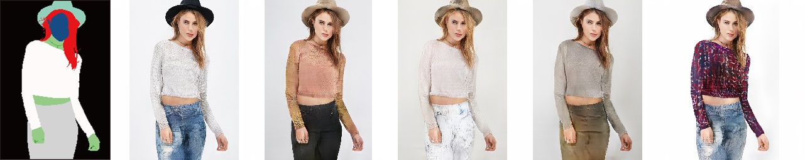

# Diversifying Semantic Image Synthesis and Editing via Class- and Layer-wise VAEs


<p align="center">

<br>
Results of multimodal semantic image synthesis and editing using our method. Our method yields highly diverse images from a single semantic mask (top), and also enables appearance editing for specific semantic objects, e.g., the clothes in the fashion images (bottom). 
</p>

This code is an implementation of the following paper: 

Yuki Endo and Yoshihiro Kanamori: "Diversifying Semantic Image Synthesis and Editing via Class- and Layer-wise VAEs," Computer Graphics Forum (Proc. of Pacific Graphics 2020), 2020. [[Project](http://www.cgg.cs.tsukuba.ac.jp/~endo/projects/clVAE/ )][[PDF](http://www.cgg.cs.tsukuba.ac.jp/~endo/projects/clVAE/endo_pg20.pdf)(10MB)][[Supp](http://www.cgg.cs.tsukuba.ac.jp/~endo/projects/clVAE/supplementary_materials.pdf)(183MB)]

## Prerequisites  
1. Python3
2. PyTorch

## Preparation
This code also requires the Synchronized-BatchNorm-PyTorch rep.
```
cd models/networks/
git clone https://github.com/vacancy/Synchronized-BatchNorm-PyTorch
cp -rf Synchronized-BatchNorm-PyTorch/sync_batchnorm .
cd ../../
```

## Inference with our pre-trained models
1. Download [our pre-trained models](https://drive.google.com/file/d/13MSBGQgaqREq6prmaZxT4uTYmsn2-RRq/view?usp=sharing). 
2. Put them in the checkpoints directory. 
3. Run the following commands for each dataset:

- ADE20K
```
python test.py --name ade20k --dataset_mode ade20k --dataroot ./datasets/ade20k/ --use_vae
```


- DeepFashion
```
python test.py --name deepfashion --dataset_mode deepfashion --dataroot ./datasets/deepfashion/ --use_vae
```


- GTA5
```
python test.py --name gta5 --dataset_mode gta5 --dataroot ./datasets/gta5/ --use_vae
```


- Style-guided synthesis

You can also specify a style id (ID of a style image in a test set) for style-guided synthesis as follws:
```
python test.py --name deepfashion --dataset_mode deepfashion --dataroot ./datasets/deepfashion/ --use_vae --style_id 1
```


## Training
First, if you want to train the networks using full training sets, please download and put them in appropriate directories in ./datasets, then

- [ADE20K](https://groups.csail.mit.edu/vision/datasets/ADE20K/)
```
python train.py --name [checkpoint_name] --dataset_mode ade20k --dataroot ./datasets/ade20k/ --use_vae --batchSize 4
```
- [DeepFashion](http://mmlab.ie.cuhk.edu.hk/projects/DeepFashion/InShopRetrieval.html)
```
python train.py --name [checkpoint_name] --dataset_mode deepfashion --dataroot ./datasets/deepfashion/ --use_vae --batchSize 4
```
- [GTA5](https://github.com/zth667/Diverse-Image-Synthesis-from-Semantic-Layout)
1. Download rarity bin and masks. (https://github.com/zth667/Diverse-Image-Synthesis-from-Semantic-Layout)
2. Put the downloaded files in ./datasets/gta5/rarity. 
3. Run the following command.
```
python train.py --name [checkpoint_name] --dataset_mode gta5 --dataroot ./datasets/gta5/ --use_vae --batchSize 4
```

## Citation
Please cite our paper if you find the code useful:
```
@article{endoPG20,
  author    = {Yuki Endo and
               Yoshihiro Kanamori},
  title     = {Diversifying Semantic Image Synthesis and Editing via Class- and Layer-wise
               VAEs},
  journal   = {Comput. Graph. Forum},
  volume    = {39},
  number    = {7},
  pages     = {519--530},
  year      = {2020},
}
```

## Acknowledgements
This code heavily borrows from the [SPADE](https://github.com/NVlabs/SPADE) repository. 
